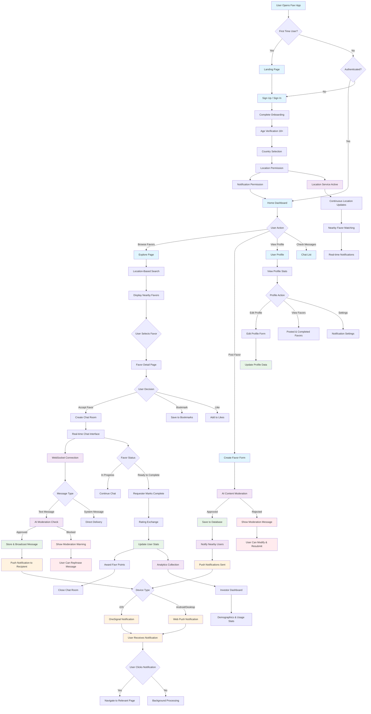
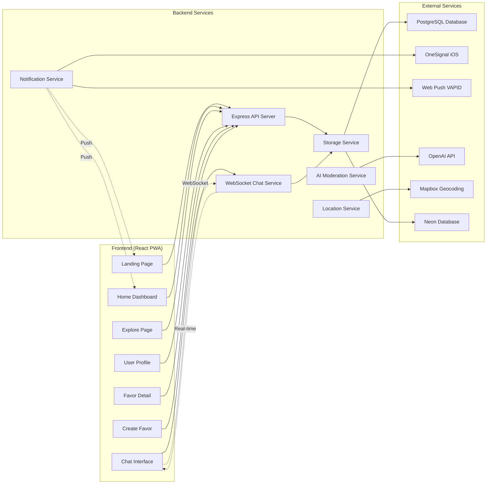
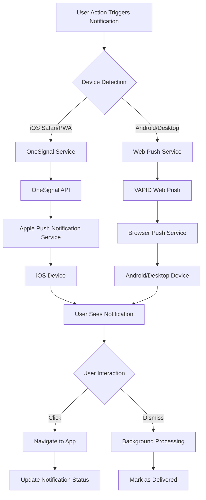
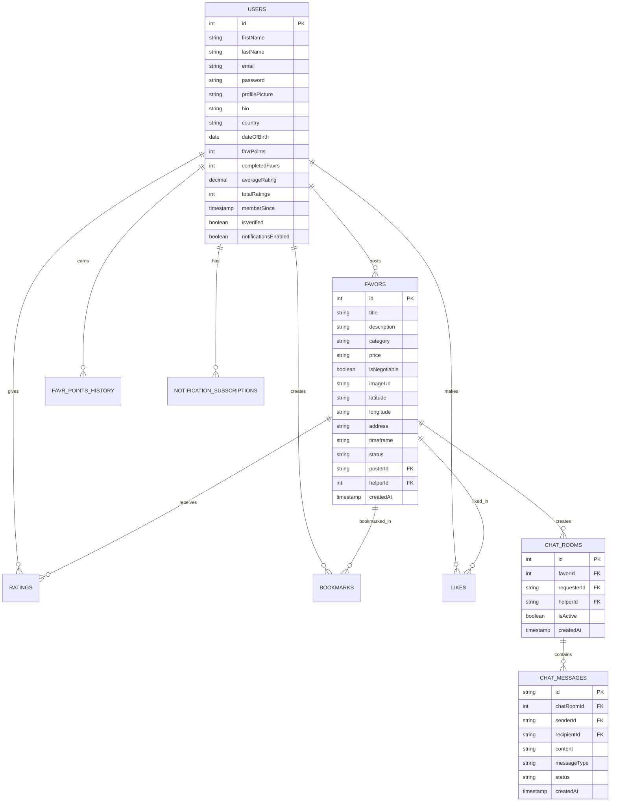
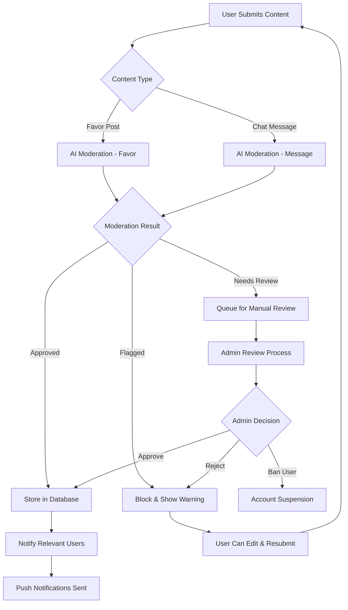

# Favr App - Complete System Flowchart

## Main User Journey & System Architecture

## Detailed Component Interaction Flow

## Notification System Architecture

## Database Schema Relationships

## Security & Moderation Flow

This comprehensive flowchart shows:

1. **User Journey**: From onboarding to favor completion
2. **System Architecture**: How frontend, backend, and external services interact
3. **Real-time Features**: WebSocket chat and push notifications
4. **Database Relationships**: How data is structured and connected
5. **Security Flow**: AI moderation and content filtering
6. **Notification System**: Multi-platform push notification delivery

The app follows a modern PWA architecture with real-time capabilities, location-based matching, and comprehensive safety features through AI moderation.